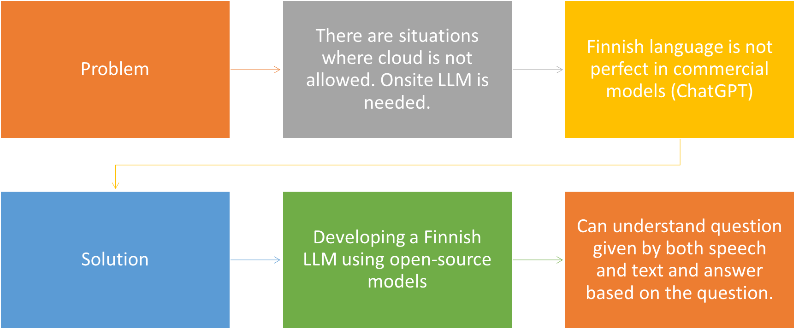
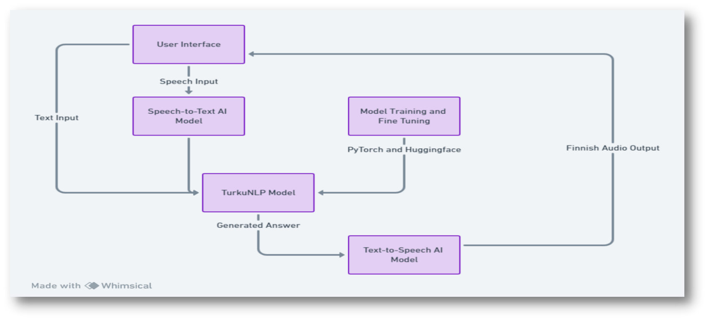

# FiLOs – Finnish LLM OnSite
## Description
This repository contains the SE.610 and SE.620 students' project work for Solita. The application shows how LLM models can be used onsite with Fi language. The application can understand spoken Finnish language and answer simple questions, leveraging training from KELA open dataset(KELA FAQs).

The system is divided into a backend and frontend. Both applications will be deployed as Docker containers and should be independent of each other.
## Project Overview

## System Architecture

## Usage instructions
### Docker Installation
To install the system using Docker, ensure Docker is installed and running, and follw these steps:

1. Clone this repository to your local machine.
```bash
git clone git@github.com:COMP-SE-610-620/FiLos.git
cd FiLos
```
2. Run the following command to build and start the Docker Containers.
```bash
docker-compose up --build
```
This will start both the frontend and backend services in detached mode.

3. Access the application:
- Frontend: http://localhost:3000
- Backend: http://localhost:8000


### Local Installation
If you want to run the application in you machine without using Docker, follw these steps:

#### Frontend
*Prerequisites:* Node.js and npm installed on your system.

1. Navigate to frontend directory
```bash
cd frontend
```
2. Install project dependencies
```bash
npm install
```
3. Start the application
```bash
npm start
```
The server will be accessible at http://localhost:3000.

#### Backend
*Prerequisites:* Python 3.9 & Pip

1. Navigate to backend directory
```bash
cd backend
```

2. Create a virtual environment:
```bash
python -m venv env
```
3. Active the environment
- On Linux/Mac, activate the environment with:

```bash
source env/bin/activate
```

- On Windows, activate the environment with:
```bash
.\env\Scripts\activate
```
- On git bash, activate the environment with:
```bash
source env/Scripts/activate
```

4. Install the required python dependencies using:

```bash
pip install -r requirements.txt
```
5. Run application ((If you encounter the ModuleNotFoundError, run Activate the environmen command agian))
```bash
uvicorn main:app --reload
```

The server will be accessible at http://localhost:8000.

The API documentation is available at http://127.0.0.1:8000/docs/. Explore the endpoints and interact with the API using the Swagger documentation.

*For a deeper understanding of the backend architecture, models, and additional information, refer to the [backend/README.md](backend/README.md)
 file.*

